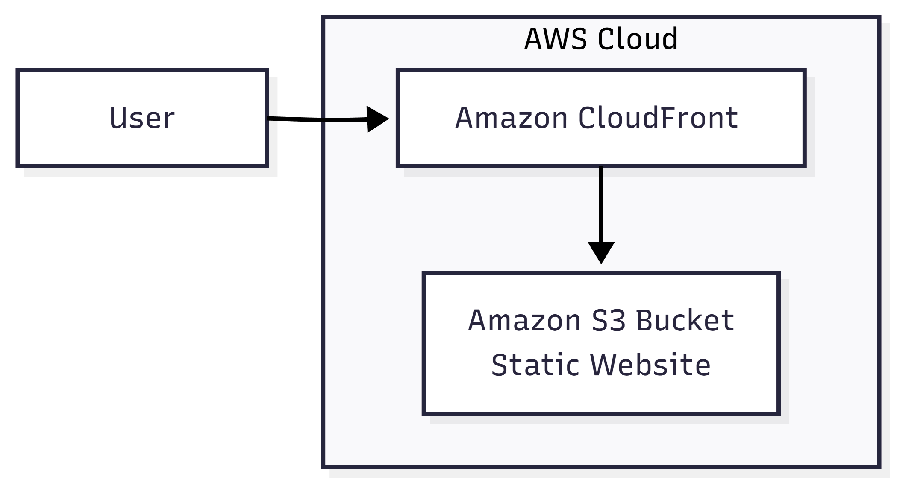

# Project 1 — Static Website Hosting on AWS (S3 + CloudFront)

## Unity WebGL Static Website Deployment

---

## 📌 Overview

This project demonstrates the deployment of a **static web application** on AWS using **Amazon S3** and **Amazon CloudFront**, following **AWS Free Tier–friendly** and **production-aware** practices.

A Unity WebGL build was used as the static asset set to simulate a real-world, asset-heavy web application deployment scenario. This project focuses on proper configuration, troubleshooting common deployment issues, and implementing global content delivery while maintaining cost efficiency.

---

## 🎯 Objectives

- Host a static website using Amazon S3
- Deliver content globally using Amazon CloudFront (CDN)
- Understand and apply S3 bucket policies
- Debug and resolve real AWS permission issues
- Configure CloudFront for optimal static content delivery
- Follow a production-style deployment workflow

---

## 🧩 Architecture



**Request Flow:**
```
User Browser → CloudFront Edge Location → Amazon S3 (Origin)
```

**Components:**
- **Amazon S3** — Stores static files (HTML, JS, WASM, asset folders)
- **Amazon CloudFront** — Delivers content globally with low latency
- **Bucket Policy** — Enables read access for the hosted content

---

## 🛠️ Tech Stack

- **Storage:** Amazon S3
- **CDN:** Amazon CloudFront
- **Security:** AWS IAM (Bucket Policies)
- **Frontend:** Unity WebGL (HTML5/WASM)
- **Region:** us-east-1 (N. Virginia)

All resources were deployed within **AWS Free Tier limits**.

---

## 📁 Repository Structure

```
project-01-static-website-s3-cloudfront/
├── README.md
├── architecture/
│   └── s3-cloudfront-architecture.png
├── policies/
│   └── s3-bucket-policy.json
├── notes/
│   └── issues-and-fixes.md
└── .gitignore
```

---

## 🚀 Implementation Steps

### 1️⃣ S3 Bucket Setup

**Bucket Configuration:**
- **Bucket Name:** `hasnain-aws-unity-webgl-build`
- **Region:** `us-east-1`
- **Public Access:** Block All Public Access disabled (for policy-based access)

**Content Upload:**
- Uploaded Unity WebGL build structure:
  - `index.html` (entry point)
  - `Build/` directory (JavaScript and WebAssembly files)
  - `TemplateData/` directory (templates and assets)

### 2️⃣ Public Access Configuration

**Bucket Policy Applied:**
- Disabled **Block All Public Access** settings
- Applied read-only bucket policy allowing `s3:GetObject` permission
- Policy configuration stored in: [`policies/s3-bucket-policy.json`](./policies/s3-bucket-policy.json)

**Policy Details:**
```json
{
  "Version": "2012-10-17",
  "Statement": [
    {
      "Sid": "PublicReadForStaticWebsite",
      "Effect": "Allow",
      "Principal": "*",
      "Action": "s3:GetObject",
      "Resource": "arn:aws:s3:::hasnain-aws-unity-webgl-build/*"
    }
  ]
}
```

### 3️⃣ CloudFront Distribution Setup

**Distribution Configuration:**
- Created CloudFront distribution with S3 as origin
- Configured **Default Root Object** as `index.html`
- Enabled automatic HTTPS via CloudFront certificates
- Configured caching behaviors for optimal performance

### 4️⃣ Troubleshooting & Issue Resolution

#### 🛑 Issue #1: CloudFront AccessDenied (403)

**Problem:**  
Accessing the CloudFront URL resulted in `403 AccessDenied` error.

**Root Cause:**  
The S3 bucket was private by default and lacked a bucket policy allowing CloudFront/public users to fetch objects.

**Solution:**  
Applied a read-only bucket policy allowing `s3:GetObject` permission. The policy explicitly grants public read access to all objects in the bucket.

**Reference:** See detailed troubleshooting in [`notes/issues-and-fixes.md`](./notes/issues-and-fixes.md)

---

#### 🛑 Issue #2: XML Response at CloudFront Root

**Problem:**  
CloudFront returned an XML directory listing instead of loading the website.

**Root Cause:**  
CloudFront distribution did not have a **Default Root Object** configured, so it couldn't determine which file to serve when accessing the root URL.

**Solution:**  
Configured **Default Root Object** to `index.html` in CloudFront distribution settings. This ensures that requests to the root domain automatically serve the main HTML file.

---

#### 🔍 MIME Type Investigation

**Investigation:**  
Checked whether manual MIME type configuration (e.g., `application/wasm` for WebAssembly files) was required for Unity WebGL builds.

**Verification Process:**
- Reviewed S3 object metadata in AWS Console
- Inspected CloudFront delivery behavior
- Checked browser developer tools network tab
- Verified Content-Type headers in HTTP responses

**Result:**  
No manual MIME type configuration was required. Modern AWS/S3 deployments automatically detect and serve the correct MIME types for Unity WebGL builds, including:
- `application/wasm` for `.wasm` files
- `application/javascript` for `.js` files
- `text/html` for `.html` files
- Appropriate types for asset files

---

### 5️⃣ Final Validation

**Testing Results:**
- ✅ Site loads successfully via CloudFront URL
- ✅ Unity WebGL game renders correctly
- ✅ No browser console errors:
  - No AccessDenied errors
  - No CORS issues
  - No WASM compile failures
  - No MIME type blocking
- ✅ Global CDN caching working as expected
- ✅ HTTPS encryption via CloudFront certificates

---

## 🔐 Security Considerations

**Current Implementation:**
This project uses a **public S3 bucket** with a read-only bucket policy for simplicity and learning purposes. The bucket contains only public static assets with no sensitive or user-generated data.

**Production Best Practices:**
For production environments, consider implementing:
- **CloudFront Origin Access Control (OAC)** — Keep S3 bucket private, allow access only through CloudFront
- **Signed URLs/Cookies** — For restricted content access
- **WAF Integration** — For DDoS protection and request filtering
- **Bucket Versioning** — For content backup and recovery

---

## 💰 Cost Analysis

**AWS Free Tier Eligibility:**
- **S3:** 5 GB standard storage, 20,000 GET requests per month (free for 12 months)
- **CloudFront:** 1 TB data transfer out, 10,000,000 HTTP/HTTPS requests (free for 12 months)

**Actual Usage:**
All resources deployed and tested within Free Tier limits. No charges incurred during project implementation.

---

## 🧪 Testing & Verification

**Manual Testing:**
1. Access CloudFront distribution URL in web browser
2. Verify Unity WebGL game loads and runs correctly
3. Check browser developer console for errors
4. Verify all assets load properly (JS, WASM, images)
5. Test from different geographic locations (CDN caching)

**Validation Checklist:**
- [x] S3 bucket configured with appropriate permissions
- [x] CloudFront distribution created and deployed
- [x] Default root object configured
- [x] Bucket policy applied correctly
- [x] Application accessible via CloudFront URL
- [x] No console errors in browser
- [x] All assets loading correctly
- [x] HTTPS encryption active

---

## 📚 Key Learnings

1. **S3 Bucket Policies** — Understanding how bucket policies control access to S3 objects
2. **CloudFront Configuration** — Importance of default root object for static website hosting
3. **Permission Troubleshooting** — Debugging AccessDenied errors systematically
4. **MIME Types** — Modern AWS automatic MIME type detection capabilities
5. **CDN Benefits** — Global content delivery and caching strategies

---

## 📌 Resume Highlights

- Deployed a static web application using Amazon S3 and CloudFront with global CDN delivery
- Diagnosed and resolved S3 `AccessDenied (403)` issues using bucket policies
- Configured CloudFront default root object for correct application routing
- Validated deployment using browser developer tools and network analysis
- Designed a Free Tier–optimized AWS static hosting solution
- Troubleshot real-world AWS configuration issues following systematic debugging approach

---

## 🔗 Additional Resources

- **Detailed Troubleshooting:** [`notes/issues-and-fixes.md`](./notes/issues-and-fixes.md)
- **Bucket Policy:** [`policies/s3-bucket-policy.json`](./policies/s3-bucket-policy.json)
- **AWS Documentation:**
  - [S3 Static Website Hosting](https://docs.aws.amazon.com/AmazonS3/latest/userguide/WebsiteHosting.html)
  - [CloudFront Getting Started](https://docs.aws.amazon.com/AmazonCloudFront/latest/DeveloperGuide/GettingStarted.html)

---

## 🏷️ Tags

AWS · S3 · CloudFront · Static Website · CDN · IAM · DevOps Portfolio · Unity WebGL
